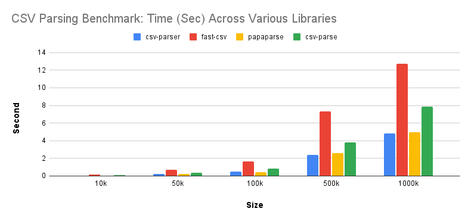

# CSV Parsing Benchmark Project

This project benchmarks four popular CSV parsing libraries in Node.js to determine their performance under different dataset sizes. The libraries compared are:

- [`csv-parser`](https://www.npmjs.com/package/csv-parser)
- [`csv-parse`](https://www.npmjs.com/package/csv-parse)
- [`papaparse`](https://www.npmjs.com/package/papaparse)
- [`fast-csv`](https://www.npmjs.com/package/fast-csv)

## Project Overview

CSV parsing is a common task in many applications. This benchmark compares the speed of these parsers to help developers choose the best tool for their use case, based on performance across varying dataset sizes from 1k to 1 million records.

### Benchmark Results

| Size  | csv-parser (ms) | fast-csv (ms) | papaparse (ms) | csv-parse (ms) |
|:------|----------------:|--------------:|---------------:|---------------:|
| 1k    | 4.68            | 14.46         | 4.98           | 7.74           |
| 2k    | 9.55            | 29.24         | 9.87           | 15.70          |
| 3k    | 13.99           | 42.13         | 14.76          | 22.71          |
| 4k    | 18.39           | 58.90         | 19.28          | 31.40          |
| 5k    | 23.49           | 70.57         | 23.80          | 38.64          |
| 10k   | 47.33           | 138.50        | 45.81          | 80.28          |
| 50k   | 234.47          | 684.22        | 220.50         | 394.24         |
| 100k  | 473.84          | 1663.71       | 438.93         | 828.91         |
| 500k  | 2371.66         | 7317.74       | 2404.32        | 3810.30        |
| 1000k | 4842.03         | 13724.31      | 4896.55        | 7899.10        |

### Graphical Representation

Below is a graphical representation of the benchmark results:

## Libraries Used

### [`csv-parser`](https://www.npmjs.com/package/csv-parser)
A lightweight, fast CSV parser for Node.js that works great with streaming data.

### [`csv-parse`](https://www.npmjs.com/package/csv-parse)
A robust CSV parsing library from the same maintainers of the `csv-stringify` package. It supports various data formats and options.

### [`papaparse`](https://www.npmjs.com/package/papaparse)
A powerful CSV parser that works both in the browser and in Node.js. It is well-suited for large datasets and includes many advanced features.

### [`fast-csv`](https://www.npmjs.com/package/fast-csv)
A comprehensive library for handling CSV and formatting data, which includes parsing, formatting, and validation capabilities.

## How to Run the Benchmark

1. Clone the repository.
2. Install dependencies using `npm install`.
3. Run the benchmark using `npm run start`.

## License

This project is licensed under the MIT License.